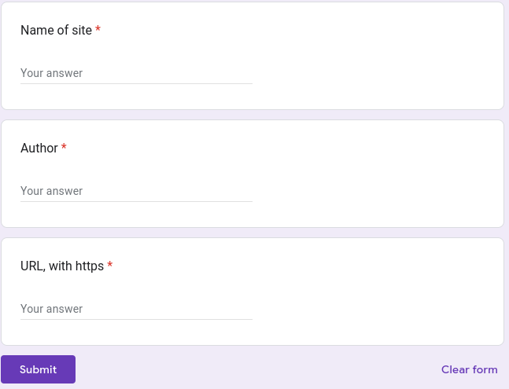

# sheetring.js

# NOT READY YET

## Description
A cool webring widget.
## Features

- Virtually zero maintenance once set up
- Cool and in js
- Customizable

## TODO

- finish sheetring.js
- Create an index page
- CSS
- Go back and do readme

## Table of Contents

### 1. [What's a webring anyway?](#what-is-a-webring-anyway)
### 2. [Webring Creation](#webring-creation)
### 3. [Ring members](#ring-members)
### 4. [Contributing](#contributing)
### 5. [License](#license)
### 6. [Acknowledgments](#acknowledgments)

## What is a webring anyway?

### The [onionring.js](https://garlic.garden/onionring/) page says it well:
```
Imagine yourself and a bunch of friends or people you share an interest with, in a circle, all holding hands. Everyone's left hand links them to the previous person in the circle, and everyone's right hand links them to the next person. Now imagine that you're a website, and your hands are hyperlinks. That's a webring! And if you click 'next' on every site, you'll eventually get back to where you started.

Back when search engines weren't very good, this was a useful way to connect your website with more users, and users with more websites that have similar content to stuff they already like. People still like to use them now because 1) We're all nostalgic for a simpler time, 2) They feel like a more honest and organic way to discover content on the internet, and 3) Search engines are starting to be not very good again.
```
## Webring creation

1. Download the sheetring.js file
2. Create a google form
3. Make the questions are along these lines, IN THIS ORDER:

4. Make sure collect emails is OFF
5. Go to responses, and click link to sheets
6. In this menu, create new sheet
7. Make sure the sheet is shared so anyone with the link can view
7. Fill out the config section in your sheetring.js file
8. Host sheetring.js
9. You probably want to use some css

### Ring members 
All they need to do is fill out the form accurately, and they will automatically be added to the ring.

They also need to attach this bit of html to their site, with whatever css you want, and the values correct:
```
<script src="YOUR SCRIPT URL"></script>
<div id="The">
</div>
```

## Contributing

If you want to improve this project:

1. Fork the project
2. Make your changes
5. Open a Pull Request

## License

This project is licensed under the MIT License - see the [LICENSE](LICENSE) for details.

## Acknowledgments

Using google sheets and forms as an autoatic server inspired by [virtualobserver](https://virtualobserver.moe/ayano/comment-widget)

Also inspired by [onionring.js](https://garlic.garden/onionring/)